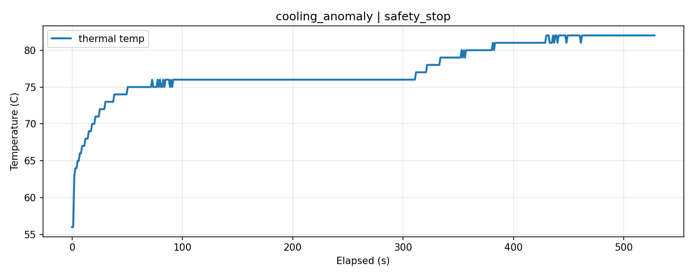
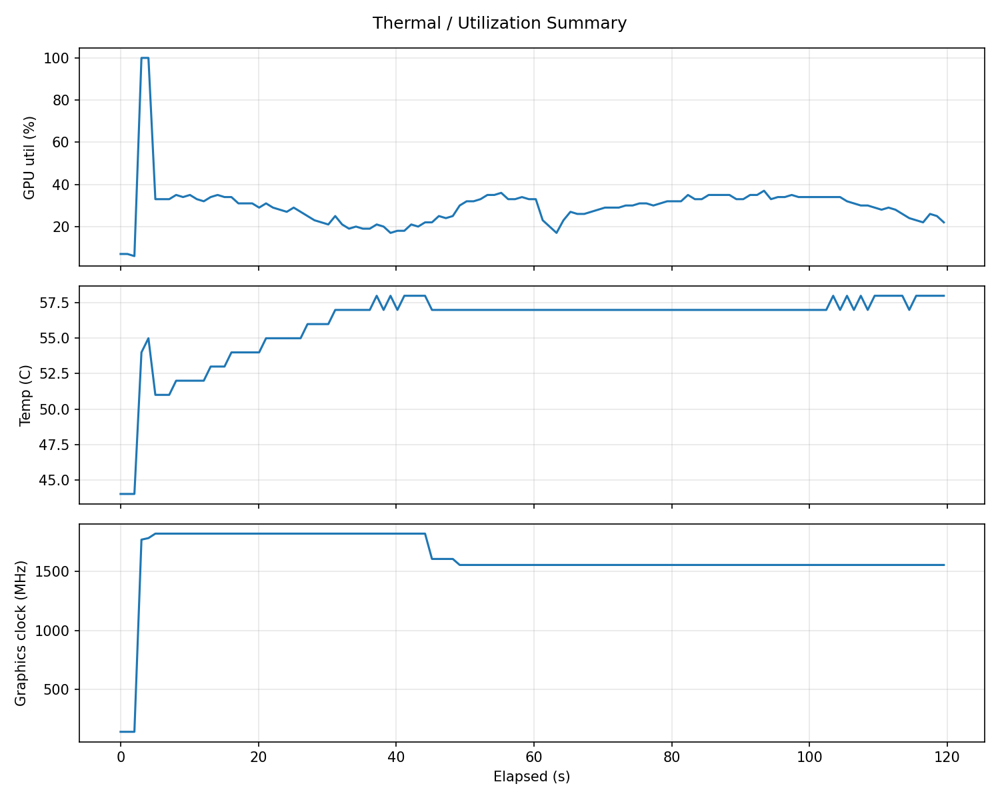
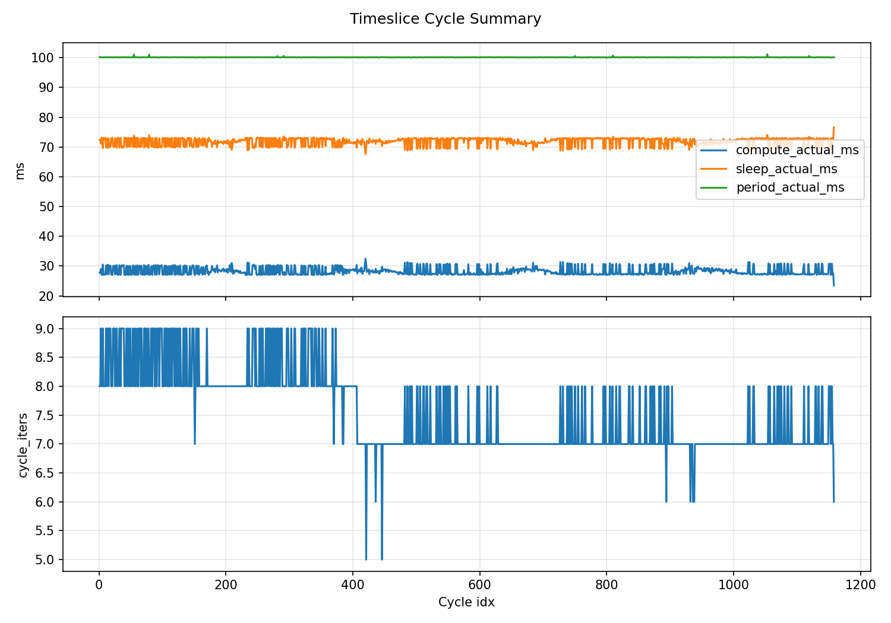

# GPU TempCTL Lab (Timeslice)

本專案用來建立可重複的 GPU 溫控與異常情境資料，核心目標是：
- 驗證 60°C / 80°C 長時間閉環溫控是否穩定。
- 在 `cooling_anomaly` 場景中注入風扇異常，觀察 thermal/perf 變化。
- 支援 `timeslice` baseline（100ms 週期內只跑部分 compute budget）來做可控占用率基線。

目前主要驗證平台：`NVIDIA GeForce GTX 1080 Ti`。

---

## 1. 專案功能與作用

本專案分三層：
- 控制層：`controller.py`（閉環控制 60/80°C）
- 負載層：`workload_torch.py`（continuous 或 timeslice 熱源）
- 情境層：`scenario_runner.py`（整合 workload/logger/fault injection 與結果封裝）

主要用途：
- 建立可比較、可重跑的熱行為資料包（`thermal.csv`/`perf.csv`/`events.csv`/`metadata.json`）。
- 產生 anomaly detection、控制器調參、工作負載辨識的資料基線。
- 以 profile 化方式管理不同機器的 timeslice baseline。

---

## 2. 最新 Timeslice 更新

### 2.1 `workload_torch.py`
支援兩種執行模式：
- `continuous`：持續 matmul（原本行為）
- `timeslice`：每個週期內算到 compute budget 後 sleep 到週期結束

已支援參數：
- `--run-style continuous|timeslice`
- `--period-ms`
- `--compute-budget-ms`
- `--warmup-seconds`
- `--cycle-report-every`
- `--timeslice-cycles-csv`

timeslice 模式會輸出 `timeslice_cycles.csv`（每 cycle 一筆）：
- `ts, cycle_idx, compute_actual_ms, sleep_actual_ms, period_actual_ms, cycle_iters`

### 2.2 `workload_profiles.py`
新增可重用 profile 管理，目前內建：
- `timeslice30_openloop_icclz1`
  - `run_style=timeslice`
  - `size=2560`
  - `period_ms=100`
  - `compute_budget_ms=27`
  - `warmup_seconds=2`
  - `cycle_report_every=100`

### 2.3 `scenario_runner.py`
`cooling_anomaly` 現在可選兩種 baseline：
- 傳統 `continuous`（`--workload-mode low|mid|high`）
- profile 型 `timeslice`（`--workload-profile timeslice30_openloop_icclz1`）

並支援 workload override：
- `--workload-size`
- `--workload-run-style`
- `--workload-period-ms`
- `--workload-compute-budget-ms`
- `--workload-warmup-seconds`
- `--workload-cycle-report-every`

`metadata.json` 會記錄：
- `requested.*`：你要求的 workload profile / override
- `effective.workload`：最終生效 workload 設定
- `artifacts.timeslice_cycles_csv`：timeslice 情境時自動帶出

### 2.4 100ms 時間切片設計與目前進度

本專案的 timeslice 設計是：
- 一個固定週期 `period_ms=100`
- 週期開始後持續做 `matmul + torch.cuda.synchronize()`
- 一旦累積 compute 時間超過 `compute_budget_ms` 就停止運算
- 週期剩餘時間用 `sleep` 補滿到 100ms
- 進入下一個 cycle

等價概念：
- 若每個 100ms 週期平均 compute 30ms，則 1 秒約 10 個週期，理論占用率約 30%
- 實務上單次 matmul 無法剛好切齊 budget，所以 `compute_actual_ms` 會略高於設定值（overshoot）

目前已完成的實測進度（`test_timeslice_util.py`）：
- `logs/timeslice_eval/ts_eval_20260405_011757/summary.json`
  - 參數：`compute_budget_ms=30`
  - `period_actual_ms mean=100.136`
  - `gpu_util_percent mean=33.275`
- `logs/timeslice_eval/ts_eval_20260405_012439/summary.json`
  - 參數：`compute_budget_ms=27`
  - `period_actual_ms mean=100.143`
  - `gpu_util_percent mean=29.667`

結論：
- **100ms 週期控制已成功達成**（兩次測試 period 平均都在 100.14ms 附近）
- 若目標是約 30% baseline，`size=2560 + budget=27ms` 在目前機器上比 `30ms` 更接近目標

---

## 3. 各程式功能（簡述）

- `scenario_runner.py`
  - 執行 `natural_high_heat` / `cooling_anomaly`
  - 啟動並管理 workload、logger、fault injection
  - 產生 run directory、`metadata.json`、summary

- `controller.py`
  - 60/80°C 閉環控制器
  - 透過 power limit 與 workload mode 調整熱行為
  - 成功條件為連續 in-band 秒數達標

- `workload_torch.py`
  - PyTorch GEMM 熱源
  - `continuous` 與 `timeslice` 雙模式
  - 可輸出 `perf.csv` 與 `timeslice_cycles.csv`

- `workload_profiles.py`
  - 管理命名 workload profile（目前含 `timeslice30_openloop_icclz1`）
  - 給 `scenario_runner.py` 讀取

- `gpu_logger.py`
  - 以固定 interval 記錄 NVML telemetry（溫度、功耗、util、fan、clock）

- `perf_logger.py`
  - workload 效能記錄器（iters、iter/s、avg_iter_ms）

- `fan_fault_injector.py`
  - 設定 manual fan / 恢復 default fan policy
  - 提供 anomaly fault 注入

- `pl_sweep.py`
  - 開環掃描多組 power limit
  - 建立穩態溫度與功耗對照資料

- `test_timeslice_util.py`
  - 校正 timeslice baseline（目標約 30% utilization）
  - 會同時啟動 `workload_torch.py` + `gpu_logger.py`
  - 輸出 summary 與可選 plot

---

## 4. 常見輸出檔案

- `thermal.csv`：熱資料（temp/power/util/fan/clock）
- `perf.csv`：workload perf（iter_per_sec/avg_iter_ms）
- `timeslice_cycles.csv`：timeslice 每 cycle 實測資料
- `events.csv`：情境事件時間線
- `metadata.json`：requested/effective/artifacts/result
- `workload_stdout.log` / `logger_stdout.log` / `controller_stdout.log`：除錯入口

---

## 5. 使用指令（正式驗證 A~E）

注意：
- 建議統一用 `python3`，避免 `python` 不存在導致 `sudo: scenario_runner.py: command not found`。
- 下列指令預設在 repo root 執行（`gpu-tempctl-lab/`）。

### 驗證 A：60°C 長時間 hold
```bash
sudo -E python3 scenario_runner.py \
  --scenario natural_high_heat \
  --target 60 \
  --hold-seconds 600 \
  --max-run-seconds 1800 \
  --output-root logs/validation_all
```

### 驗證 B：80°C 長時間 hold
```bash
sudo -E python3 scenario_runner.py \
  --scenario natural_high_heat \
  --target 80 \
  --hold-seconds 600 \
  --max-run-seconds 1800 \
  --output-root logs/validation_all
```

### 驗證 C：cooling anomaly（continuous baseline）
```bash
sudo -E python3 scenario_runner.py \
  --scenario cooling_anomaly \
  --workload-mode mid \
  --power-limit 250 \
  --run-seconds 900 \
  --fault-start 300 \
  --fault-seconds 300 \
  --fault-fan-percent 50 \
  --sample-interval 1 \
  --safety-temp 83 \
  --output-root logs/validation_all
```

### 驗證 D：timeslice baseline 校正
```bash
python3 test_timeslice_util.py \
  --duration-sec 120 \
  --gpu-index 0 \
  --size 2560 \
  --period-ms 100 \
  --compute-budget-ms 27 \
  --warmup-seconds 2 \
  --sample-interval 1 \
  --cycle-report-every 100 \
  --plot
```

### 驗證 E：cooling anomaly（timeslice30 baseline）
```bash
sudo -E python3 scenario_runner.py \
  --scenario cooling_anomaly \
  --workload-profile timeslice30_openloop_icclz1 \
  --power-limit 250 \
  --run-seconds 900 \
  --fault-start 300 \
  --fault-seconds 300 \
  --fault-fan-percent 50 \
  --sample-interval 1 \
  --safety-temp 83 \
  --output-root logs/validation_all
```

---

## 6. 實用補充

### 6.1 profile + 臨時覆寫
例如沿用 `timeslice30_openloop_icclz1`，但臨時改 compute budget：
```bash
sudo -E python3 scenario_runner.py \
  --scenario cooling_anomaly \
  --workload-profile timeslice30_openloop_icclz1 \
  --workload-compute-budget-ms 25 \
  --power-limit 250 \
  --run-seconds 900 \
  --fault-start 300 \
  --fault-seconds 300 \
  --fault-fan-percent 50 \
  --sample-interval 1 \
  --safety-temp 83 \
  --output-root logs/validation_all
```

### 6.2 檢查 Python 指令
```bash
which python
which python3
```
若 `which python` 沒結果，請使用 `python3`。

---

## 7. 歷史驗證圖（`Figure/`）

以下為目前放在 `./Figure` 的驗證圖，可直接在 GitHub README 預覽：

### 7.1 Temperature Curve

`temperature_curve.png`



`temperature_curve copy.png`


`temperature_curve copy 2.png`


### 7.2 Timeslice 驗證圖

`thermal_summary.png`



`timeslice_summary.png`


