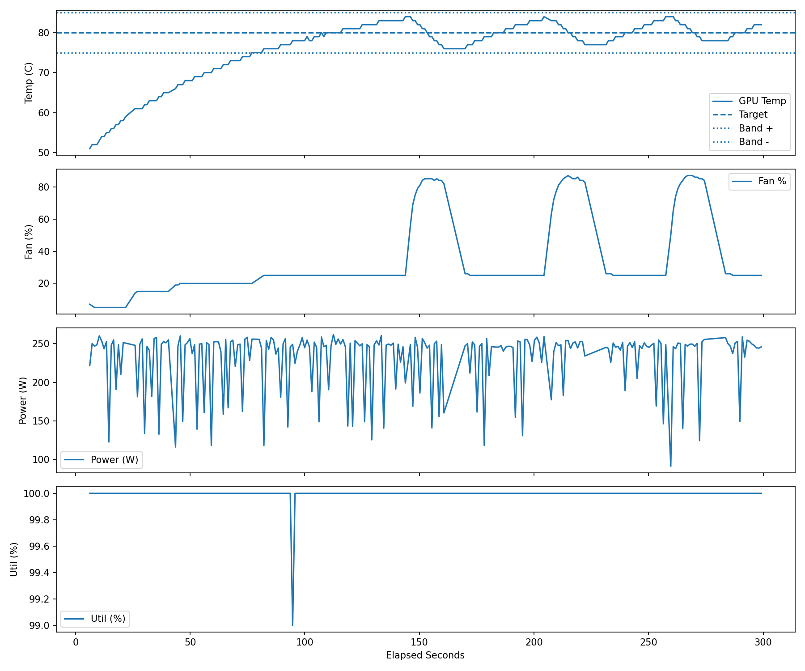

# fan_control_lab

`fan_control_lab` 是這個 repo 裡用來做 GPU-only 熱控實驗的小型工具集，目標是用 CoolerControl mode 切換建立可重現的升溫、降溫與 80°C 附近 hold 測試。



## 目的

- 建立 GTX 1080 Ti 的可重複高負載熱源
- 驗證 CoolerControl mode-based fan control 是否可穩定運作
- 做 baseline / fault / recovery 情境測試
- 建立 `80 ± 5°C` 的 GPU supervisor，並在結束時自動 restore 到 `GPU_DEFAULT`

## 主要腳本

- `gpu_load_torch.py`：用 PyTorch 建立 GPU 高負載
- `logger.py`：每秒記錄 GPU 溫度、功耗、util、fan 與 clocks
- `supervisor_check.py`：簡單觀察目前溫度是否在 band 內
- `gpu_scenario_runner_auto.py`：自動跑 baseline / fault / recovery
- `gpu_supervisor_80.py`：80°C mode-based supervisor

## 先備條件

- 主機已安裝並啟動 CoolerControl daemon
- `~/.cargo/bin/cctv` 可用
- NVIDIA driver / `nvidia-smi` 可正常讀值
- Python venv 已安裝 `requests`、`matplotlib`、`torch`

建議每個新終端先載入：

```bash
cd ~/gpu-tempctl-lab
source ../gpu-tempctl-1080ti/bin/activate
source fan_control_lab/env.sh
source "$HOME/.cargo/env"

export CCTV_DAEMON_PASSWORD='your-password'
export MPLCONFIGDIR="$HOME/.config/matplotlib"
mkdir -p "$MPLCONFIGDIR"
```

如果要用 REST API 記錄 `/devices`，請在 `fan_control_lab/env.sh` 設好 `CC_BASE` 與 `CC_TOKEN`。

## 常用執行方式

跑 80°C supervisor：

```bash
python3 fan_control_lab/gpu_supervisor_80.py \
  --tag sup80_fault5_v2 \
  --target 80 \
  --band 5 \
  --seconds 300 \
  --min-dwell-seconds 15 \
  --size 4096 \
  --duty 1.0 \
  --period-ms 100 \
  --initial-mode GPU_FAULT_5
```

每次執行會在 `fan_control_lab/logs/<timestamp>_<tag>/` 產生：

- `metadata.json`
- `thermal.csv`
- `events.csv`
- `summary.json`
- `scenario_plot.png`
- `report.txt`
- `workload_stdout.log`
- `workload_stderr.log`
- `cc_devices.jsonl`（若有 `CC_TOKEN`）

## 近期結果

`20260405_205617_sup80_fault5_v2` 摘要如下：

- `samples`: `247`
- `temp_min_c`: `51.0`
- `temp_max_c`: `84.0`
- `temp_mean_c`: `76.251`
- `temp_last30_mean_c`: `80.567`
- `fan_mean_pct`: `32.619`
- `power_mean_w`: `230.866`
- `util_mean_pct`: `99.996`
- `within_band_ratio`: `0.7449`

代表這版 supervisor 已能完成預熱、升溫、進入 `80 ± 5°C` band，並在程式結束後恢復到 `GPU_DEFAULT`。
